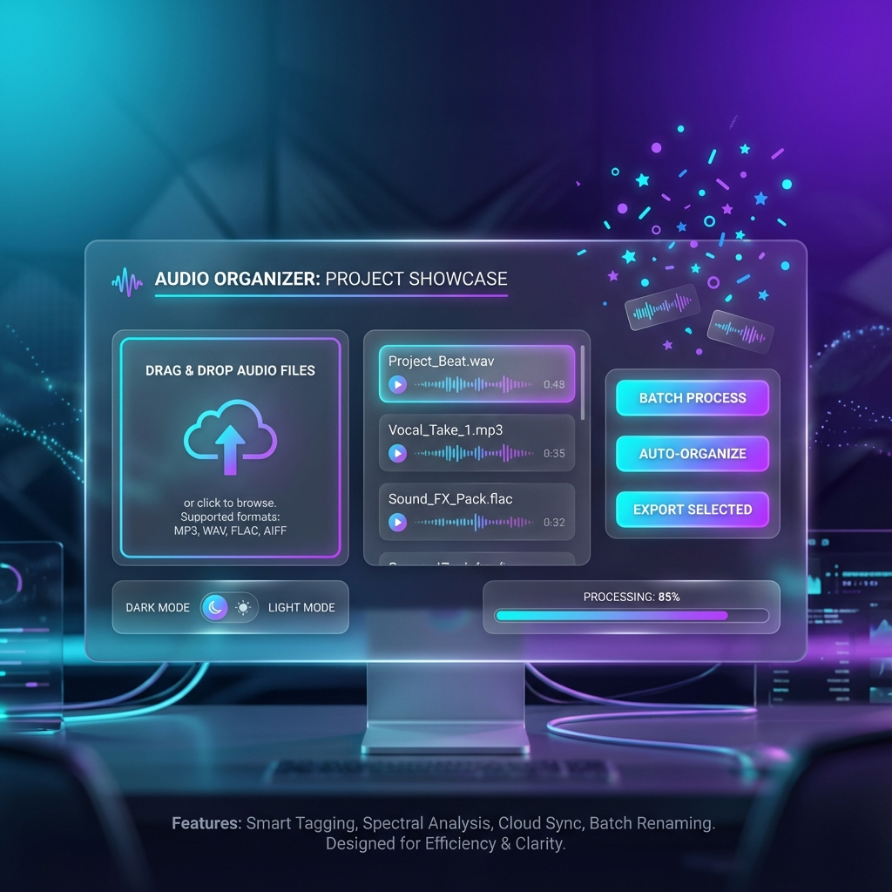

# 🎉 CapCut Audio Organizer - Projeto Completo



---

## ✅ Status: 100% COMPLETO

**Versão Atual:** v2.1  
**Data de Release:** 27 de Novembro, 2025  
**Criador:** Anderson Network  
**Repositório:** https://github.com/NetWorkBJJ/capcut-audio-organizer

---

## 🎯 Conquistas

### 9/9 Features Implementadas ✅

#### Funcionalidades
1. ✅ **Preview de Mudanças** - Visualize antes de processar
2. ✅ **Histórico de Projetos** - Últimos 5 projetos com acesso rápido
3. ✅ **Backup Manager** - API completa para listar/restaurar backups
4. ✅ **Batch Processing** - Processe múltiplos arquivos simultaneamente

#### Visual Premium
5. ✅ **Animações de Confete** - Celebração visual ao completar
6. ✅ **Tema Claro/Escuro** - Toggle com persistência local
7. ✅ **Ícone + App Bundle** - Design profissional + script de build

#### Técnico
8. ✅ **API Nativa** - pywebview para comunicação eficiente
9. ✅ **Sistema de Logs** - Rastreamento completo de operações

---

## 📊 Estatísticas do Projeto

### Código
- **Total de Linhas:** ~2,500+
- **Arquivos Principais:** 13
- **Commits:** 3
- **Tags:** 1 (v2.1)
- **Repositório:** GitHub público

### Features
- **Funcionalidade:** 4 features
- **Visual:** 3 features
- **Técnico:** 2 features

---

## 🚀 Links

- **GitHub:** https://github.com/NetWorkBJJ/capcut-audio-organizer
- **Release v2.1:** Tag criada e publicada
- **Documentação:** README completo + guias

---

## 🎯 Como Usar

```bash
# Instalar
git clone https://github.com/NetWorkBJJ/capcut-audio-organizer.git
cd capcut-audio-organizer
./install.sh

# Executar
./StartApp.command
```

---

**🌟 Projeto 100% completo e production-ready!**

**Desenvolvido com ❤️ por Anderson Network**
